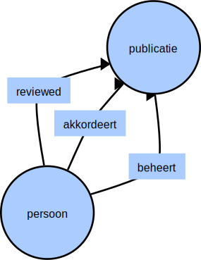
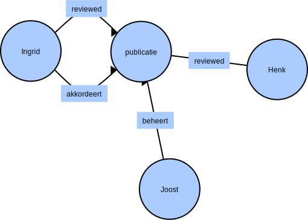

 ## Virtual Society Graphs

Virtual Society gebruikt YAML definities om Graph databases te modeleren. In Virtual Society bestaan Graphs als Nodes en Edges.
Het minimum viable product (MVP) voor het design van de data opslag van Virtual Society is gebaseerd op 3 eigenschappen:

1. Tijdsaspecten (Historische bevragingen, periodes etc.)
2. Persoonlijke relaties (Kind/Ouder/Kostendeler relaties etc.)
3. Regel/Wetgeving rule opslag van Urukagina

### Status

Concept/Idee/Work in progres. Nog niet alle code voor deze MVP is in place.

### Microsoft SQL 

Voordat we ingaan op de YAML representaties voor graph, doen we eerst een dive in microsoft sql. Microsoft SQL wordt Primair
ondersteund door Virtual Society.

#### Voorbeeld Publicatie meschanismen

##### Stap 1 Database opschonen

```SQL
drop table if exists beheert;
drop table if exists reviewed;
drop table if exists akkordeert;

drop table if exists persoon;
drop table if exists publicatie;
```
##### Stap 2 Graph Nodes aanmaken

```SQL
CREATE TABLE persoon (
  ID INTEGER PRIMARY KEY,
  [name] VARCHAR(100)
) AS NODE;

CREATE TABLE publicatie (
  ID INTEGER PRIMARY KEY,
) AS NODE;
```

##### Stap 3 Graph Edges aanmaken

```SQL
CREATE TABLE akkordeert (moment DATETIME) AS EDGE;
CREATE TABLE reviewed (moment DATETIME) AS EDGE;
CREATE TABLE beheert (moment DATETIME) AS EDGE;
```

Het schema kan nu als volgt ontologisch worden weergegeven:



##### Stap 4 Nodes vullen met gegevens

Personen leggen vanuit hun werkproces relaties. We voeren 3 personen op om te kunnen gaan testen.

```SQL
INSERT INTO persoon VALUES (1,'joost');
INSERT INTO persoon VALUES (2,'henk');
INSERT INTO persoon VALUES (3,'ingrid');
```

##### Stap 5 Edges vullen met relaties

Het volgende script legt verbindingen tussen nodes door deze te verbinden met de beschikbare edge typen.
Dit kan bijvoorbeeld gebeuren vanuit human-workflow waarin Joost, Henk en Ingrid participeren.

```SQL
-- stap 1. Er wordt een publicatie in het systeem aangemaakt
INSERT INTO publicatie VALUES(1);
-- stap 2. Joost beheert de publicatie
INSERT INTO beheert VALUES ((SELECT $node_id FROM persoon WHERE ID = 1), 
       (SELECT $node_id FROM publicatie WHERE ID = 1),GETDATE());
-- stap 3. (a en b) Zowel henk als ingrid reviewen de publicatie
INSERT INTO reviewed VALUES ((SELECT $node_id FROM persoon WHERE ID = 2), 
       (SELECT $node_id FROM publicatie WHERE ID = 1),GETDATE());
INSERT INTO reviewed VALUES ((SELECT $node_id FROM persoon WHERE ID = 3), 
       (SELECT $node_id FROM publicatie WHERE ID = 1),GETDATE());
-- stap 4. Ingrid akkordeert de publicatie
INSERT INTO akkordeert VALUES ((SELECT $node_id FROM persoon WHERE ID = 3), 
       (SELECT $node_id FROM publicatie WHERE ID = 1),GETDATE());
```

Vanuit de eerdere ontologie ontstaan iedere keer moment opnamen op de edges. Deze worden opgeslagen in de graph.
De uiteindelijk opname (state) na deze stappen kan als volgt weergeven worden:



##### Stap 6 View voor een publicatiescherm

Joost wil graag een overzicht van welke publicaties onder review zijn door welke personen en wie deze inmiddels geakkordeerd heeft.
De volgende view modeleert semantisch een view om deze informatie weer te geven:

```SQL
--- Zoek welke items een persoon onder publicatiebeheer heeft 
--- en door wie deze momenteel gereviewed of geakkoordeerd worden
--- De nieuwste akkorderingen vershijnen boven aan de lijst
--- Scenario: Zowel henk als ingrid zijn reviewer. Inmiddels heeft ingrid een akkordering gegeven
--- Deze query voor deze view is semantisch gemodeleerd.
SELECT publicatie.ID as publicatieId,
       beheert.moment as beheermoment, 
       reviewer.name as reviewer,
       reviewer.ID as reviewerId,
       akkordeerder.name as akkordeerder,
       akkordeerder.ID as akkordeerderId,
       akkordeert.moment as akkorderingsmoment,
       reviewed.moment as reviewmoment
FROM persoon,beheert, publicatie, persoon reviewer, reviewed, persoon akkordeerder, akkordeert
WHERE MATCH (persoon-(beheert)->publicatie AND reviewer-(reviewed)->publicatie AND akkordeerder-(akkordeert)->publicatie)
AND persoon.id = 1 ORDER BY akkorderingsmoment DESC
```

De volgende gegevens worden gecorreleerd:

|       publicatieId    |             beheermoment          |             reviewer    |             reviewerId    |             akkordeerder    |             akkordeerderId    |             akkorderingsmoment    |             reviewmoment                      |
|-----------------------|-----------------------------------|-------------------------|---------------------------|-----------------------------|-------------------------------|-----------------------------------|-----------------------------------------------|
|          1            |    2020-02-16T13:59:28.3800000    |    henk                 |    2                      |    ingrid                   |    3                          |    2020-02-16T13:59:28.4030000    |    2020-02-16T13:59:28.3900000                |
|    1                  |    2020-02-16T13:59:28.3800000    |    ingrid               |    3                      |    ingrid                   |    3                          |    2020-02-16T13:59:28.4030000    |    2020-02-16T13:59:28.3970000                |

#### Opslag Regelgeving

Om binnen het publicatieproces de configuratie omtrent regelgeving op te kunnen slaan, breiden we het model als volgt uit:

##### Stap 1 Database opschonen

```SQL
drop table if exists regelgeving;
```
##### Stap 2 Graph Nodes aanmaken

```SQL
CREATE TABLE bestand (
  ID INTEGER PRIMARY KEY,
  Inhoud NTEXT
) AS NODE
```

##### Stap 3 Graph Edges aanmaken

```SQL
CREATE TABLE regelgeving AS EDGE
```

Het schema kan nu als volgt ontologisch worden weergegeven:


##### Stap 4 Nodes vullen met gegevens

In het vorige voorbeeld waren Joost, Ingrid en Henk onderdeel van een werkproces om publicaties te reviewen en te akkorderen. Het is natuurlijk van
belang dat men de regelgeving die geakkordeerd moet worden kunnen inzien. Hiertoe voegen we het document toe aan de publicatie.

```SQL
INSERT INTO bestand VALUES (1,'yaml content');
```

##### Stap 5 Edges vullen met relaties

Het volgende script legt verbindingen tussen nodes door deze te verbinden met de beschikbare edge typen.
Dit kan bijvoorbeeld gebeuren vanuit human-workflow waarin Joost, Henk en Ingrid participeren.

```SQL
-- stap 1. De publicatie wordt gekoppeld aan de het regelgevingsbestand.
INSERT INTO regelgeving VALUES ((SELECT $node_id FROM publicatie WHERE ID = 1), 
       (SELECT $node_id FROM bestand WHERE ID = 1));
```

Voorts kunnen alle publicaties getoond worden welke bestanden bevatten van het type regelgeving.

```SQL
SELECT bestand.Inhoud as bestandsinhoud 
FROM publicatie,regelgeving,bestand
WHERE MATCH ( publicatie-(regelgeving)->bestand)
```

| bestandsinhoud |
|----------------|
| yaml content   |

De uiteindelijk opname (state) na deze stappen kan als volgt weergeven worden:

*TODO: Plaatje bijvoegen*

##### Stap 6 View voor het publicatiescherm

Het publicatiescherm kan nu uitgebreid worden met de type bestanden als onderdeel van de publicatie.

```SQL
--- Zoek welke items een persoon onder publicatiebeheer heeft 
--- en door wie deze momenteel gereviewed of geakkoordeerd worden
--- De nieuwste akkorderingen verscheinen boven aan de lijst
--- Scenario: Toon naast het vorige scenario ook de type bestanden binnen de publicatie.
--- Deze query voor deze view is semantisch gemodeleerd.
SELECT publicatie.ID as publicatieId,
       bestand.ID as bestandsId,
       bestand.Naam as bestandsnaam,
       beheert.moment as beheermoment, 
       reviewer.name as reviewer,
       reviewer.ID as reviewerId,
       akkordeerder.name as akkordeerder,
       akkordeerder.ID as akkordeerderId,
       akkordeert.moment as akkorderingsmoment,
       reviewed.moment as reviewmoment
FROM persoon,beheert, publicatie, persoon reviewer, reviewed, persoon akkordeerder, akkordeert, regelgeving, bestand
WHERE MATCH (
        persoon-(beheert)->publicatie AND 
        reviewer-(reviewed)->publicatie AND 
        akkordeerder-(akkordeert)->publicatie AND
        publicatie-(regelgeving)->bestand
)
AND persoon.id = 1 ORDER BY akkorderingsmoment DESC
```

De volgende gegevens worden gecorreleerd:

|       publicatieId    |             beheermoment          |             reviewer    |             reviewerId    |             akkordeerder    |             akkordeerderId    |             akkorderingsmoment    |             reviewmoment                      |
|-----------------------|-----------------------------------|-------------------------|---------------------------|-----------------------------|-------------------------------|-----------------------------------|-----------------------------------------------|
|          1            |    2020-02-16T13:59:28.3800000    |    henk                 |    2                      |    ingrid                   |    3                          |    2020-02-16T13:59:28.4030000    |    2020-02-16T13:59:28.3900000                |
|    1                  |    2020-02-16T13:59:28.3800000    |    ingrid               |    3                      |    ingrid                   |    3                          |    2020-02-16T13:59:28.4030000    |    2020-02-16T13:59:28.3970000                |


### JSON-LD

Als het gaat om gestructureerde gegevens, linked data in het bijzonder, zijn er verschillende formaten 
waaronder SKOS, Microdata, RDFa, etc). Hoewel dit allemaal goede formaten zijn, zijn sommige zeker
eenvoudiger te implementeren dan andere. Als je op zoek bent naar een gestructureerde opmaak die effectief 
is maar niet veel tijd vereist om te implementeren, biedt JSON-LD een goede markup.

De reden dat JSON-LD grotendeels wordt beschouwd als de "gemakkelijkere" versie van markup is te wijten
aan een paar factoren:

1. Alle gestructureerde gegevens kunnen worden toegevoegd tussen twee \<script> -tags in de \<head> 
   van een HTML-document.
2. Het is niet nodig om alleen op een ontwikkelaar te vertrouwen om gestructureerde gegevens te implementeren.
3. Er is minder risico op opmaakfouten.

Gestructureerde gegevensopmaak zoals Microdata of RDFa zijn effectief, maar is meestal iets ingewikkelder
om te implementeren, waardoor de kans op mogelijke fouten groter is. JSON-LD is een eenvoudige manier om
gestructureerde gegevens te implementeren die een eenvoudigere syntaxis gebruiken.

#### JSON vs. JSON-LD
Voordat we JSON-LD behandelen, is het belangrijk om te begrijpen wat JSON is. JSON staat voor 
"JavaScript Object Notation". Het is een flexibel formaat voor het doorgeven van gegevens tussen verschillende
soorten toepassingen. Het is een lichtgewicht en relatief simplistische methode voor ons om te schrijven en
voor machines om te parsen en te genereren. Hieronder zie je een voorbeeld van een publicatieoverzicht.

*"Curly Braces"* worden gebruikt om een object te definieren en er de individuele eigenschappen in te kenmerken. 
Wanneer er een eigenschap is, is er ook een waarde die wordt gescheiden door een dubbele punt.
Wanneer waarden worden gebruikt die geen getallen zijn, worden ook quotes "" rondom die waarden toegevoegd.
Bijvoorbeeld "bestandsnaam" in de onderstaande afbeelding laat zien dat de publicatie zorgtoeslag.yaml betreft.

```JSON
{
    @"type" : "publicatieoverzicht",
    "publicatieId" : 1,
    "bestandsnaam" : "zorgtoeslag.yaml",
    "beheermoment" : "2020-02-16T13:59:28.3800000",
    "reviewer" : "henk",
    "reviewerId" : 2,
    "reviewmoment" : "2020-02-16T13:59:28.3900000",
    "beheerderId" : 1
}
```

### YAML Voorbeelden

[Voorbeeld Ouder <-> Kind Relaties](./doc/kind-ouder-relaties.md)

