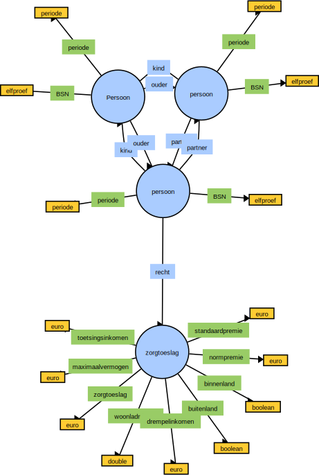

 # Virtual Society Graphs

#### Voorbeeld Ouder <-> Kind Relaties

Het yaml script hieronder toont een Persoon node met 3 edges. Deze edges hebben een constraint van persoon tot persoon. Dit wil zeggen
dat de edges alleen van toepassing zijn op relaties van persoon tot persoon. Andere typen Nodes kunnen niet met elkaar verbonden worden.

Dit helpt ons om de integriteit op relaties tussen node typen te waarborgen.

De edges hebben periode attributen. Voor tijdreizen in de database kunnen we op deze manier historisch het verloop bekijken tussen
interpersoonlijke relaties over tijd. De node heeft tevens ook een periode attribuut. Dit betreft in dit voorbeeld de levensduur van de persoon.

```YAML
Name: persoon
Attributes:
- Name: BSN
  Type: elfproef
- Name: periode
  Type: periode
Edges:
- Name: partner
  Constraints:
  - Name: persoon
  Attributes:
  - Name: periode
    Type: periode
- Name: kind
  Constraints:
  - Name: persoon
- Name: ouder
  Constraints:
  - Name: persoon
"
```


#### Voorbeeld Recht op Zorgtoeslag

De graph voor recht op zorgtoeslag wordt gegenereerd vanuit de Urukagina rule engine. De gedigialiseerde regels omtrent de regelgeving zijn dus
leidend voor het genereren van de data structuur. Generatie geschiedt als volgt:

1. **Node**: Alle attributen die berekend worden d.m.v. formules worden opgeslagen in de Node zelf. In het geval van de zorgtoeslag berekening:

```YAML
Name regelingen.zorgtoeslag
Attributes:
- Name: toetsingsinkomen
  Type: euro
- Name: maximaalvermogen
  Type: euro
- Name: zorgtoeslag
  Type: euro
- Name: woonlandfactor
  Type: double
- Name: drempelinkomen
  Type: euro
- Name: buitenland
  Type: boolean
- Name: binnenland
  Type: boolean
- Name: normpremie
  Type: euro
- Name: standaardpremie
  Type: euro
- Name: periode
  Type: periode
```

2. **Edge**: Aangezien Urukagina recht geeft tot regelingen en voorzieningen wordt het de edge "recht" uitgebreid met een constraint tot de regeling in kwestie.
   In dit geval:

```YAML
Edges:
- Name: recht
  Constraint: persoon -> zorgtoeslag
  Attributes:
  - Name: periode
    Type: periode
```

De opslagmogelijkheden van de graph is nu als volgt:



Zowel de Edge "recht" evenals de Node zelf kennen het tijdsaspect "periode". In het geval van de Edge betekent dit de duur van het recht hebben
op de regeling (via toekenning vanuit human workflow binnen het business process). In het geval van de Node betreft dit de rechtsgeldende periode van de regeling zelf. Voor toeslagen geldt over het algemeen een
jaar geldigheid.

N.b. Er is dus een business proces nodig, welke nieuwe edges aanmaakt naar nieuwe versies van regelingen aanmaakt en daarbij de attributen moet 
die nog niet voorhanden zijn voor het toekennen van recht.

### Resources

Graph illustraties gemaakt d.m.v.: https://csacademy.com/app/graph_editor/