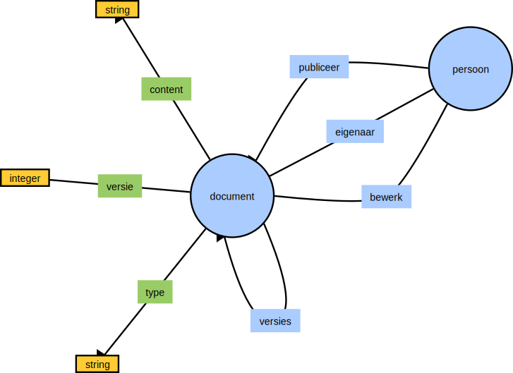

#  Virtual Society

## CMS

### Storage Providers

#### GitHub File Storage Service

Virtual Society biedt via deze service de mogelijkheid om bestand onder versiebeheer op te slaan op Github. Github opslag wordt
gebruikt voor gepubliceerde documenten die een productiestatus bereikt hebben. Tot op dat moment wordt het hele CMS review
proces binnen een graph database opgeslagen.

##### Configureren

Voor Unit Tests project voeg een bestand toe genaamd: cred.json met de volgende gegevens:

```json
{
  "github": {
    "api-key": "<jouw api key>",
    "repo": "<naam van de repository>",
    "user": "<naam van de gebruiker>",
    "product": "<naam van het product>" 
  }
}
```

Voor een uitgebreide beschrijving hoe tokens te configureren zie: https://github.com/settings/tokens

#### Graph database

Voordat content gepubliceerd wordt op github heeft de CMS ook een interne kopie van documentstromen opgeslagen in een graph db.
Hoe MVP struktuur van de CMS bestaat momenteel uit: 

# 

##### YAML Configuratie

De struktuur in YAML script:

```YAML
naam: OpenId
attributen:
  -naam: gebruikersId
```

```YAML
name: bestand
attributen:
- naam: content
  type: tekst
- naam: type
  type: tekst
- versie: getal
```

```YAML
naam: persoon
attributen:
- naam: voornamen
  type: tekst
- naam: voorvoegsel
  type: tekst
- naam: geslachtsnaam
  type: tekst
verbindingen:
  naam: digitaleIdentiteit
  verbinding:
  - naam: openId
```
