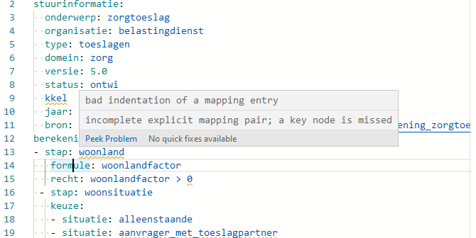
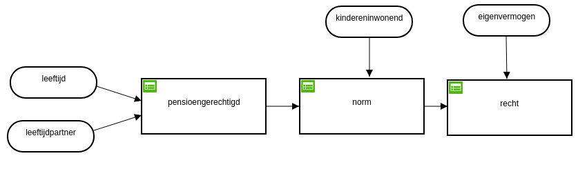
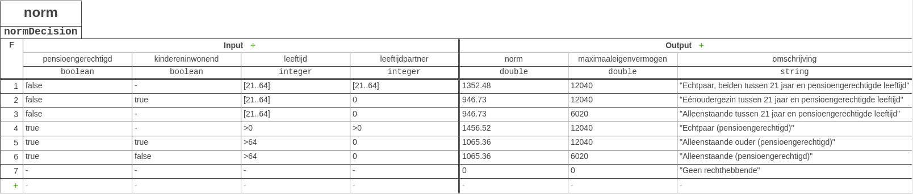
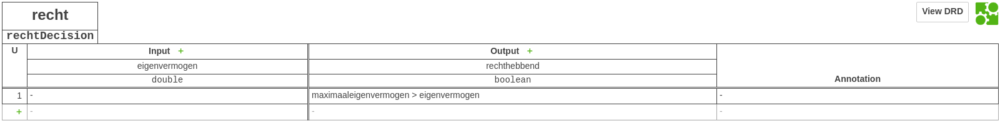

# Virtual Society

Virtual Society is een innovatief open source project die zich primair richt op het Sociale Domein Inkomen en Zelfredzaamheid van de burger. Virtual Society zoekt continu samenwerking met partijen om verder op te schalen. Het project volgt de volgende principes:

* Compliance by Design;
    * Privacy 
    * Regulatory
    * Know your customer (KYC)
* IT Efficiency
    * Standaardisering
    * Super computing
    * 

Verder onderkent Virtual Society dat bestaande legacy (SILO) systemen mogelijk gemoderniseerd kunnen worden middels recentelijke technologische ontwikkelingen maar dat de waarde propositie van deze legacy systemen nog steeds valide zijn. Door de huidige ontwikkelingen is het van 
belang een 2e spoor te bewandelen zodat de waarde propositie vanuit de innovatie (hype) cycle voldoende gestabliseerd is. Inzichten
opendoen en leren door doen zijn een must. Herbouw
van bestaande Legacy systemen binnen Mode1 cycli is onwenselijk omdat veroudering snel op de loer ligt door invloed van deze cycle en er vaak onvoldoende inzichten zijn in de visie om een duurzaam product te definieeren die niet snel gedateerd raakt.
Door voldoende inzichten op te doen vanuit Mode 2 cycli kunnen de legacy systemen deels vervangen of uitgebreid worden middels "Lift- en Shift" principes.

Virtual Society geloofd dat de waarde propositie van dien aart moet zijn dat voldaan wordt bij de eerder genoemde compliance by design.

De implementaties waar Virtual Society aan werkt bevatten een aantal werknamen met daarin een aantal onderdelen dit het systeem materialiseren:

1. **Persona Agents**<br/>
Agents die vanuit soevereiniteit namens een persoon digitale handelingen verichten omtrent de verwerking van verifieerbare referenties.
2. **Urukagina**<br />
Gepersoonliseerde view op wet- en regelgeving gerealiseerd door een semantische vastlegging van regelgeving en bevraging van persoonskenmerken uit andere bronnen die hiervoor significant zijn.
3. **Morstead**<br />
Vastlegging computaties vanuit (historische) feiten binnen veerkrachtige, schaalbare cloudservices en andere gedistribueerde applicaties.
4. **Quanta**<br/>
Experimenten met Quantum Proof Encryptie Technologien (Post Quantum) t.b.v. bescherming soevereiniteit regie op gegevens.

## Persona Agents

### Gedecentraliseerde Identiteit

Virtual Society implementeert gedecentraliseerde identiteiten volgens Decentralized Identifiers<sup>**1**</sup> (DID) standaarden. De DID Standaard welke vormgegeven vanuit het W3C consortium door partijen waaronder [Evernym](https://www.evernym.com/). DID is een wereldwijd geaccepteerde standaard waar meerdere partijen,naast Virtual Society, aan werken. Het bekende IRMA van de privacy by design foundation onderzoekt momenteel ook de mogelijkheden middels de DID specificatie voor verhoogde interoperabiliteit binnen het gedecentraliseerde wereldwijde vertrouwensnetwerk. De opslag van een DID document staat los van het gebruikte medium. Veelal worden deze versleuteld opgeslagen in digitale kluizen van personen op devices, waaronder mobiele telefoons. De uitgevers van DID's slaan deze bijv. op binnen de document opslagsystemen van de organisatie zelf om bij te houden welke referenties werden uitgegeven. Deze opslag is noodzakelijk voor recovatie van referenties indien deze nodig zijn vanuit compliance. Ook zijn er mogelijkheden om verwijzingen naar DID documenten op de blockchain (public) op te slaan. Laatstgenoemde biedt de mogelijkheid om onweerlegbaar (immutable) vast te stellen dat meerdere partijen een vertrouwensband hebben opgebouwd rondom een identificatie zonder de specifieke inhoud daarvan in te hoeven zien, ook wel Zero Knowledge Proof <sup>**2**</sup> (ZKP) genoemd. Private chains binnen de overheid werden ook geimplementeerd. De waardepropositie vvoor de burger hiervan is echter vele malen minder dan wanneer er gebruik gemaakt wordt van de public chain. Recente ontwikkelen waaronder IPV8<sup>**3**</sup>, gaan een stap verder door digitale identiteit (trust over IP) rechtstreeks binnen het internet communicatie protocol op te nemen.

#### Huidige (gecentraliseerde) situatie

Het huidige DigiD werkt vanuit een gecentraliseerde persoonlijke identiteitskenmerkopslag (BSN) waarbij het kenmerk versleuteld wordt uitgegeven vanuit een centraal PKI overheidscertificaat. Daarnaast is een BSN niet voor iedereen een persoonlijk privé kenmerk. Zo staan BSN's bij bepaalde doelgroepen staan opgenomen als het kenmerk BTW-NUMMER. Dit schaalt niet voor een volledige digitalisering van persoonlijke identiteitsinformatie volgens AVG richtlijnen <sup>**4**</sup>.

Persoonlijke Identiteiten worden defacto gedecentraliseerd opgebouwd. Personen hebben vele digitale interacties met verschillende instanties binnen de centrale- en decentrale overheid, academia en het bedrijfsleven. Personen centraliseren rondom bijv. mijnoverheid.nl via een DigiD is slechts een deeloplossing een identiteit dient volledig ontkoppeld te zijn van de specifieke applicaties. Er is immers een grote verscheidenheid aan  applicaties die mensen helpen bij een specifieke vraag, waaronder de overheid.

<sup>**1**</sup>Decentralized Identifiers: https://www.w3.org/TR/did-core/<br/>
<sup>**2**</sup>Zero Knowledge Proof: https://en.wikipedia.org/wiki/Zero-knowledge_proof<br/>
<sup>**3**</sup>IPV8: https://github.com/Tribler/py-ipv8<br/>
<sup>**4**</sup>AVG i.h.k.v. BSN: https://www.rendement.nl/algemene-verordening-gegevensbescherming-avg/nieuws/rechter-verplicht-ander-btw-nummer-eenmanszaak-per-2020.html

<hr>

####  Nieuwe (gedecentraliseerde) situatie
Om inzicht te krijgen in de complexiteit die decentralisatie met zich mee brengt is er ook sprake van een gedragsverandering welke noodzakelijk van hoe partijen met elkaar samenwerken binnen deze digitale transformatie. Virtual Society manifesteert zich hiertoe als één van de implementaties binnen het DISCIPL raamwerk. [DISCIPL](https://discipl.org/) is een **DIS**tributed **C**ollaborative **I**nformation **PL**atform en is een Decentralized Autonomous Organization (DAO). Een DAO betreft een organisatie die wordt vertegenwoordigd door regels die zijn gecodeerd als een computerprogramma die transparant zijn (compliance by design). Ze wordt gecontroleerd door aandeelhouders en niet wordt beïnvloed door een centrale overheid. De *"aandeelhouders"* binnen DISCIPL zijn veelal mensen die elkaar helpen om de computerprogramma's vorm te geven die ten dienst staan van de digitale transformatie. Daarnaast is het credo, "If it's not open source, it does not exist". Deel oplossingen worden als demonstrators gepresenteerd en zijn door iedereen te bezichten en uit te voeren.

Om dergelijk platform te laten bestaan kijkt Virtual Society wat zo'n platform succesvol maakt en wat er nodig is om succesvol te blijven. Hierbij wordt gebruikt gemaakt van inzichten vanuit een redelijk nieuw model "Social Architecture". Het gaat hier om de beantwoording in hoe gedragingen van stakeholders binnen het platform getransformeerd kunnen worden.

##### Implementatie

##### Verifieerbare Referenties


<sub>Verifieerbare Referentie Creatie Flow</sub>

Creatie Flow Stappen:

1. Persoon vraagt haar **Persona Agent** om haar te helpen een verifieerbare referentie over haar identiteit te krijgen.
2. Haar **Persona Agent** verbindt haar met een **Uitgever** van legitimatiegegevens die haar identiteit kan verifiëren.
3. De **uitgever** onderzoekt haar documentatie.
4. Ze zijn tevreden, dus de **uitgever** genereert een verifieerbare referentie die informatie over haar identiteit bevat die is gekoppeld aan hun eigen vertrouwde referentie.
5. De **uitgever** levert de verifieerbare referentie terug aan haar **Persona Agent**.
6. **Persoon** in kwestie bekijkt de verifieerbare referentie om ervoor te zorgen dat deze aan haar vereisten voldoet.
7. Als de **Persoon** tevreden is, instrueert ze haar **Persona Agent** om de verifieerbare referentie op te slaan in haar kluis, zodat ze deze in de toekomst kan gebruiken.
8. De **Persona Agent** communiceert met haar **kluis** en geeft de instructie om de nieuwe verifieerbare gegevens op te slaan.
9. De **kluis** retourneert een lijst met de verifieerbare referenties die de **Persoon** in kwestie voor de **Persona Agent** heeft.
10. De **Persona Agent** toont de **Persoon** haar verifieerbare gegevensverzameling - en bevestigt alles wat ze beschikbaar heeft.

## Urukagina

Uru-ka-gina, Uru-inim-gina of Iri-ka-gina (Sumerisch: 𒌷𒅗𒄀𒈾  
URU-KA-gi.na; ca. 24e eeuw voor Christus, korte chronologie) was een heerser (ensi) van de stadstaat Lagash in Mesopotamië. Hij nam de titel van koning aan en beweerde goddelijk te zijn benoemd bij de val van zijn corrupte voorganger Lugalanda.

Hij is vooral bekend om zijn hervormingen om corruptie te bestrijden, die soms worden genoemd als het eerste voorbeeld van een wettelijke code in de geschiedenis.

### DSL Semantische regels

Het project modeleert een domeinspecifieke taal rondom wet en regelgeving. Domeinspecifieke talen *Domein Specific Languages* (DSL's) zij gericht op een bepaald aspect van een softwaresysteem. DSL's zijn waardevol omdat, mits deze goed is ontworpen veel gemakkelijker te modeleren zijn dan een traditionele programmeertaal. Dit verbetert de productiviteit van programmeurs aanzienlijk. Het kan met name ook de communicatie met domeinexperts vanuit de wet en regelgeving verbeteren, wat een belangrijk hulpmiddel is om een ​​van de moeilijkste problemen bij softwareontwikkeling aan te pakken.

De DSL die ontwikkelt wordt is semantisch uitbreidbaar en kan daardoor zonder programmeerkennis door domein experts worden uitgebreid.

Semantiek rondom wet- en regelgeving kan, via consensus vastgelegd worden vastgelegd in een lexicon door de domein experts. Hierdoor kunnen bijvoorbeeld vastgelegde termen zoals: *toetsingsinkomen en *alleenstaande* vastgelegd worden in het model en direct gebruikt worden in de DSL. Deze manier van vastlegging is essentieel voor

1. Kwaliteitsysteem wet- en regelgeving
2. Ontologische eenduidige vastlegging voor enterprise architectuur.
3. Informatiearchitectuur voor zaken zoals vindbaarheid, hergebruik en relevantie vanuit klantreizen via omnichannel

De DSL is gebaseer op YAML notatie. YAML is veelgebruikt bij het configureren van software systemen en heeft
de laatste jaren een leidende positie ingenomen.

Het voordeel hiervan is dat er vele content editors zijn die de YAML struktuur zelf kunnen verwerken en feedback kunnen geven aan de domein expert op correct syntacticsch gebruik ervan (zgn. Linting).


<sub>Fig. YAML Editor Linting

### Voorbeeld van de DSL binnen Urukagina:

```YAML
# Zorgtoeslag for burger site demo
stuurinformatie:
  onderwerp: zorgtoeslag
  organisatie: belastingdienst
  type: toeslagen
  domein: zorg
  versie: 5.0
  status: ontwikkel
  jaar: 2019
  bron: https://download.belastingdienst.nl/toeslagen/docs/berekening_zorgtoeslag_2019_tg0821z91fd.pdf
berekening:
 - stap: woonland
   formule: woonlandfactor
   recht: woonlandfactor > 0
 - stap: woonsituatie
   keuze:
   - situatie: alleenstaande
   - situatie: aanvrager_met_toeslagpartner
 - stap: vermogensdrempel
   situatie: alleenstaande, aanvrager_met_toeslagpartner
   keuze:
   - situatie: hoger_dan_vermogensdrempel
   - situatie: lager_dan_vermogensdrempel
   recht: lager_dan_vermogensdrempel
 - stap: inkomensdrempel
   situatie: alleenstaande, aanvrager_met_toeslagpartner
   keuze:
   - situatie: hoger_dan_inkomensdrempel
   - situatie: lager_dan_inkomensdrempel
   recht: lager_dan_inkomensdrempel
 - stap: toetsingsinkomen
   situatie: alleenstaande, aanvrager_met_toeslagpartner
   waarde: toetsingsinkomen
   recht: toetsingsinkomen < toetsingsinkomensdrempel
 - stap: zorgtoeslag
   situatie: alleenstaande, aanvrager_met_toeslagpartner
   formule: zorgtoeslag
formules:
 - woonlandfactor:
     formule: lookup('woonlandfactoren',woonland,'woonland','factor', 0)
 - standaardpremie:
   - situatie: alleenstaande
     formule: 1609
   - situatie: aanvrager_met_toeslagpartner
     formule: 3218
 - toetsingsinkomensdrempel:
   - situatie: alleenstaande
     formule: 29562
   - situatie: aanvrager_met_toeslagpartner
     formule: 37885
 - toetsingsvermogensdrempel:
   - situatie: alleenstaande
     formule: 114776
   - situatie: aanvrager_met_toeslagpartner
     formule: 145136
 - drempelinkomen:
     formule: 20941
 - normpremie:
   - situatie: alleenstaande     
     formule: min(percentage(2.005) * drempelinkomen + max(percentage(13.520) * (toetsingsinkomen - drempelinkomen),0), 1189)
   - situatie: aanvrager_met_toeslagpartner
     formule: min(percentage(4.315) * drempelinkomen + max(percentage(13.520) * (toetsingsinkomen - drempelinkomen),0), 2314)
 - zorgtoeslag:
     formule: round((standaardpremie - normpremie) * woonlandfactor / 12,2)
tabellen:
  - naam: woonlandfactoren
    woonland, factor:
      - [ Nederland,           1.0    ]
      - [ België,              0.7392 ]
      - [ Bosnië-Herzegovina,  0.0672 ]
      - [ Bulgarije,           0.0735 ]
      - [ Cyprus,              0.1363 ]
      - [ Denemarken,          0.9951 ]
      - [ Duitsland,           0.8701 ]
      - [ Estland,             0.2262 ]
      - [ Finland,             0.7161 ]
      - [ Frankrijk,           0.8316 ]
      - [ Griekenland,         0.2490 ]
      - [ Hongarije,           0.1381 ]
      - [ Ierland,             0.8667 ]
      - [ IJsland,             0.9802 ]
      - [ Italië,              0.5470 ]
      - [ Kaapverdië,          0.0177 ]
      - [ Kroatië,             0.1674 ]
      - [ Letland,             0.0672 ]
      - [ Liechtenstein,       0.9720 ]
      - [ Litouwen,            0.2399 ]
      - [ Luxemburg,           0.7358 ]
      - [ Macedonië,           0.0565 ]
      - [ Malta,               0.3574 ]
      - [ Marokko,             0.0193 ]
      - [ Montenegro,          0.0821 ]
      - [ Noorwegen,           1.3729 ]
      - [ Oostenrijk,          0.6632 ]
      - [ Polen,               0.1691 ]
      - [ Portugal,            0.2616 ]
      - [ Roemenië,            0.0814 ]
      - [ Servië,              0.0714 ]
      - [ Slovenië,            0.3377 ]
      - [ Slowakije,           0.2405 ]
      - [ Spanje,              0.4001 ]
      - [ Tsjechië,            0.2412 ]
      - [ Tunesië,             0.0292 ]
      - [ Turkije,             0.0874 ]
      - [ Verenigd Koninkrijk, 0.7741 ]
      - [ Zweden,              0.8213 ]
      - [ Zwitserland,         0.8000 ]
      - [ Anders,              0      ]
```
### Vergelijking met Decision Models (DMN)

Alhoewel er ook andere technologien zijn om regelgeving semantisch vast te leggen, waaronder de Decision Model and Notation standaard (DMN), betreft deze meer een modeleringstechniek dan een DSL. Via de modelerings techniek wordt het model binnen de notatie standaard opgeslagen. Dit
heeft een aantal nadelen t.o.v. de voornoemde DSL.

* Textueel onleesbaar zonder visualisering middels user interfaces.
* Kent geen context omtrent wet- regelgeving, is generiek.

Aangezien de DSL een rijkere addreseering kent op het domein specifieke vraagstuk, kunnen generieke DMN bestanden (indien wenselijk binnen bepaalde automatiseringsystemen) gegenereert worden vanuit de DSL.

Hier een voorbeeld van de "leesbaarheid" van een DMN model (fragment):

```XML
<?xml version="1.0" encoding="UTF-8"?>
<definitions xmlns="http://www.omg.org/spec/DMN/20151101/dmn.xsd" xmlns:biodi="http://bpmn.io/schema/dmn/biodi/1.0" id="bijstandsnormEnRecht" name="Bijstandsnorm en Recht" namespace="http://camunda.org/schema/1.0/dmn">
  <decision id="pensioengerechtigd" name="pensioengerechtigd">
....
    <decisionTable id="DecisionTable_17q0i1a" hitPolicy="FIRST">
      <input id="InputClause_1fq593y" label="leeftijd">
        <inputExpression id="LiteralExpression_00rpi6q" typeRef="integer">
          <text>leeftijd</text>
        </inputExpression>
      </input>
      <input id="InputClause_1ksf3gm" label="leeftijdpartner">
        <inputExpression id="LiteralExpression_0ncyanw" typeRef="integer">
          <text>leeftijdpartner</text>
        </inputExpression>
      </input>
      <output id="OutputClause_1grwt1j" label="pensioengerechtigd" name="pensioengerechtigd" typeRef="boolean" />
      <output id="OutputClause_11q9xgq" label="omschrijving" name="omschrijving" typeRef="string" />
      <rule id="DecisionRule_0v3oi11">
        <description></description>
        <inputEntry id="UnaryTests_0r74pux">
          <text>&gt; 64</text>
        </inputEntry>
        <inputEntry id="UnaryTests_07mzs74">
          <text>&gt; 0</text>
        </inputEntry>
        <outputEntry id="LiteralExpression_1030zv3">
          <text>true</text>
        </outputEntry>
....
```
<sub>Fig. Voorbeeld van een DMN notatie</sub>

Deze notatie komt voort vanuit een deelmodelering omtrent de aanvraag algemene bijstandsutkering. De notatie kan visueel worden weergegeven middels een Decision Relation Diagram (DRD) waarin men kan doorklikken op de betreffende Decision Tables.

#### Decision Relation Diagram

De bovenstaande notatie wordt binnen het DRD diagram als volgt weergegeven:



#### Decision Tables

Het diagram toont de volgende decision tables door erop te klikken kunnen de volgende tabellen 1 voor 1 gevisualiseerd worden.

##### pensioen gerechtigd


##### norm


##### recht


### The Bigger Picture


#### Informatie Architectuur

Het structurele semantische ontwerp en de uitkomsten die uit het model voortvloeien vanuit de berekeningen kunnen gedeeld worden binnen informatieomgevingen. Het systeem deelt haar informatie middels volgende omgevingen:

* Haar eigen supercomputing platform [morstead](#morstead)
* RESTful API's middels OAS3.0

#### Kwaliteitssysteem

#### Enterprise Architectuur

## <a name="morstead"></a>Morstead  

